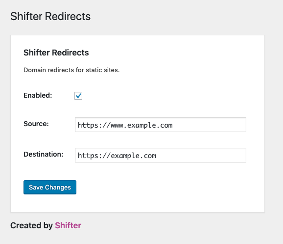

# Shifter Redirects

A redirects plugin for static WordPress sites.

## How-to use Shifter Redirects

1. Start by downloading and installing this plugin.
2. Navigate to the settings page. `WordPress Dashboard / Settings / Shifter Redirects`
3. Add your Source and Destination
4. Check enabled

- Source: What URL to redirect from.
- Destination: What URL to redirect to.

## Example

- Source: `https://www.example.com`
- Destination: `https://example.com`

Accessing the web address `https://www.example.com`, users will be redirected to `https://example.com` with subpages if any, and URL query params.

## FAQs

### Why do I need another redirect plugin?

You don't, with a few exceptions. Most (maybe all) current redirect plugins for WordPress use PHP and a server like NGINX or Apache to handle redirects. For static sites you'll need a different solution. This plugin is designed to work with the popular Redirections plugin or as a standalone for some features.

### What does it do?

It is designed as a helper plugin to work alongside Redirections. Support for regex/wildcard redirects is coming soon. For now, it supports TLD redirects such as www to non-www and vice versa.

### What is a TLD redirect?

TLD standard for Top Level Domain. That's the web address of your site without any sub pages. For example, `www.example.com`. TLD redirects are ones that replace the domain with a new one. They are also known as a root or domain redirect.

### But my DNS provider offers TLD redirects, do I need this?

Maybe? We built this two reaons. First, users with DNS providers who don't offer domain redirects and second, users who need support for regex/wildcard redirects.

## Current Use
Redirect top level domains such as `example.com` to `www.example.com` for static sites in a serverless hosting environment.

## Future Use
Support for regex style redirects with the WordPress Redirections plugin.
